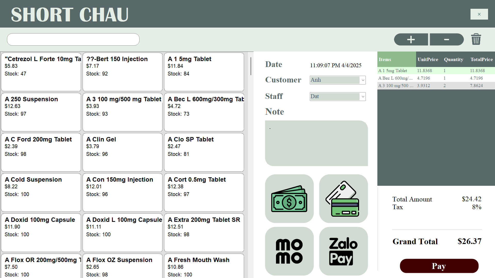
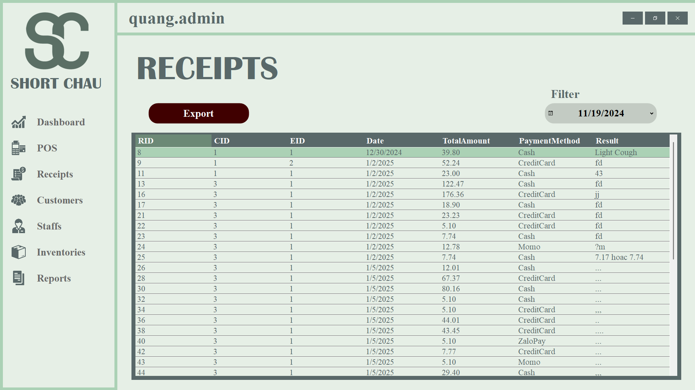
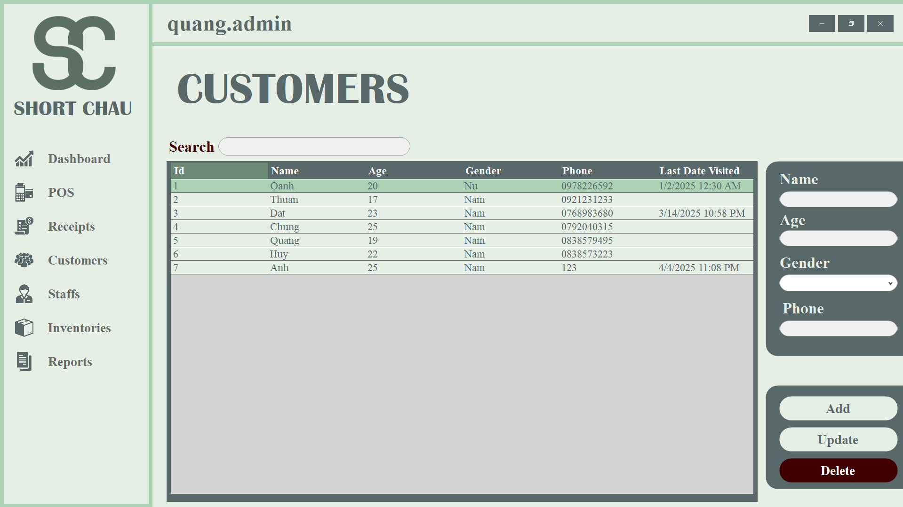
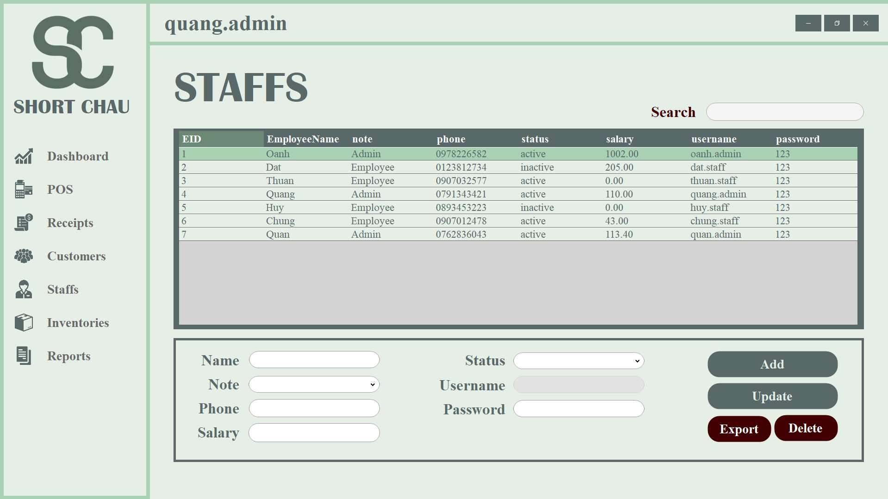
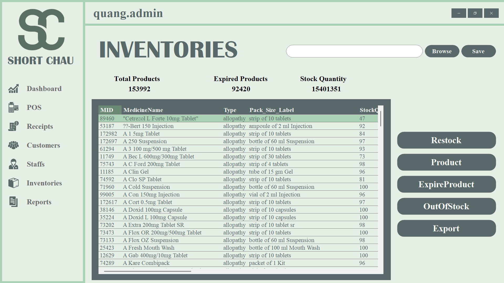
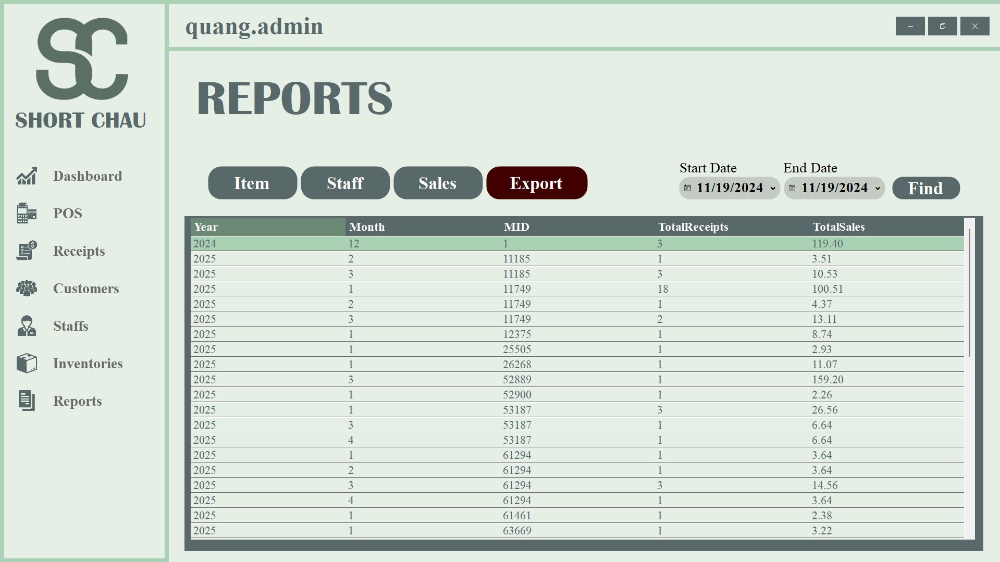

# Pharmacy Management System
A Windows Forms-based Pharmacy Management System designed to simplify the management of a retail pharmacy. This system helps pharmacists handle tasks such as managing medicine inventory, processing sales, generating reports, and assisting with prescription handling.

## Technologies Used
- **C#** – Windows Forms  
- **ADO.NET Framework** – Three-Tier Architecture  
- **SQL Server** – Database Management

## Installation
1. **Clone the repository**
   Open your terminal or Git Bash and run: *`git clone https://github.com/ChanDatt/Pharmacy_Management_System.git`*
2. **Deploy Database from** *`ShortChauDB.dacpac`*
3. **Open Solution File** and **Run The Project** *[QLNT.sln](./QLNT.sln)*

## Video demo project - [https://youtu.be/](https://youtu.be/QD2IIm_1Y4s?si=73kGd7Fax6sSlUDH)
## Product Features and Screen Shots
<table>
  <tr>
    <td>Video demo project</td> 
  </tr>
  <tr>
    
  </tr>
 </table>

<table>
  <tr>
    <td><em>Login Form</em></td> 
  </tr>
  <tr>
    <td></td>
  </tr>
 </table>

<table>
  <tr>
    <td><em>Dashboard</em></td> 
  </tr>
  <tr>
    <td></td>
  </tr>
 </table>

 <table>
  <tr>
    <td><em>POS</em></td> 
  </tr>
  <tr>
    <td></td>
  </tr>
 </table>

 <table>
  <tr>
    <td><em>Receipts</em></td> 
  </tr>
  <tr>
    <td></td>
  </tr>
 </table>

 <table>
  <tr>
    <td><em>Customers</em></td> 
  </tr>
  <tr>
    <td></td>
  </tr>
 </table>

<table>
  <tr>
    <td><em>Staffs</em></td> 
  </tr>
  <tr>
    <td></td>
  </tr>
 </table>

 <table>
  <tr>
    <td><em>Inventories</em></td> 
  </tr>
  <tr>
    <td></td>
  </tr>
 </table>

 <table>
  <tr>
    <td><em>Reports</em></td> 
  </tr>
  <tr>
    <td></td>
  </tr>
 </table>

